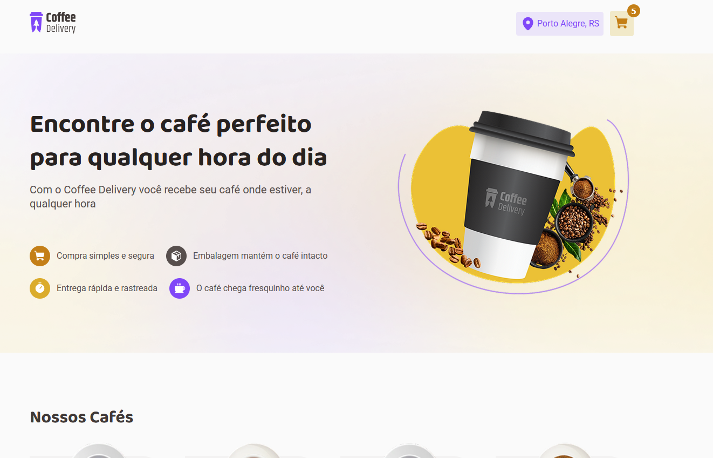
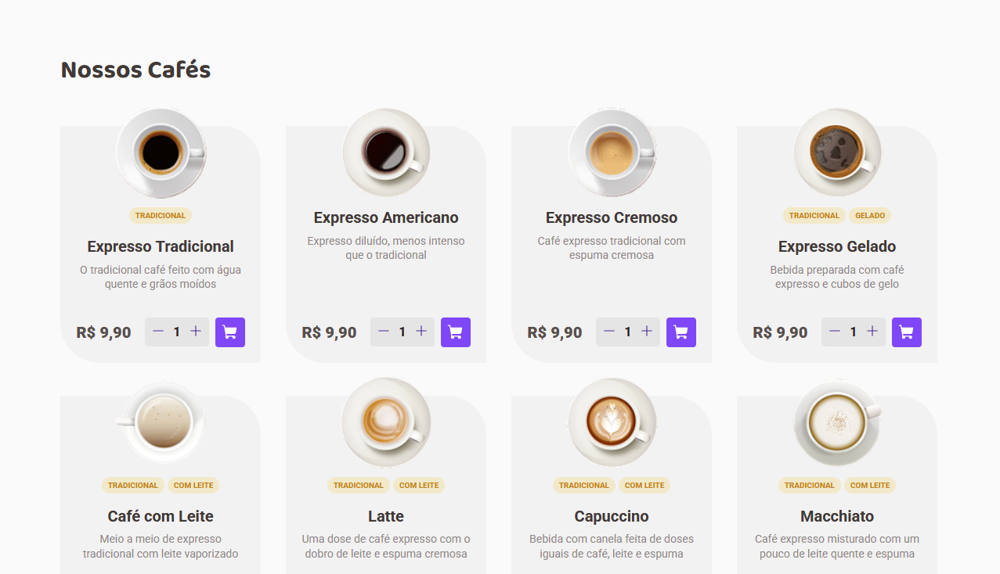
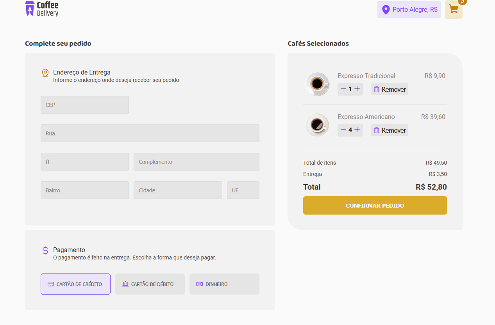
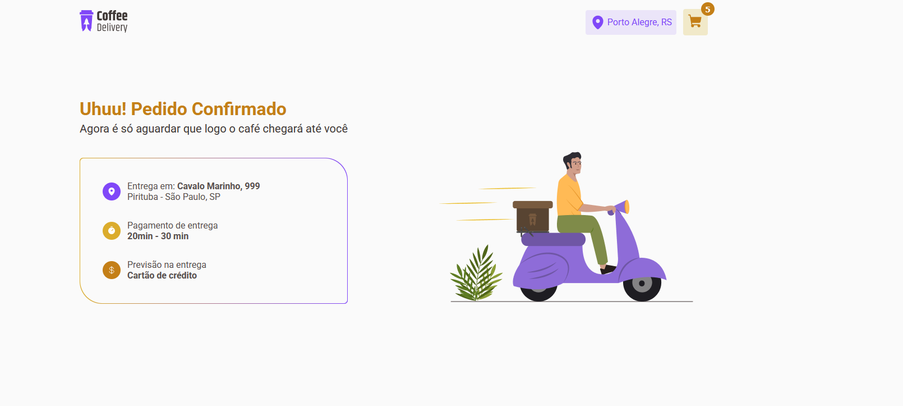

[🇬🇧 English](#coffee-delivery-english) | [🇧🇷 Português](#coffee-delivery-portugues)

---

## Coffee Delivery English

A modern Coffee Delivery e-commerce built with React, TypeScript, and styled-components. Includes a home page, product listing, checkout with address and payment forms, and a success confirmation page.

📌 Features

- [x] Browse a list of coffee products

- [x] Add products to cart

- [x] Checkout

- [x] View order confirmation page

🚀 Technologies Used

[](https://skillicons.dev)

📸 Demo

📍 Home Page <br>


🛒 Product Listing & Cart <br>


📦 Checkout Form (Address + Payment) <br>


🎉 Success Page <br>


🔧 How to Run the Project

Clone the repository:

git clone https://github.com/Cleber-Severo/coffe-delivery

Navigate to the project folder:

cd ./coffe-delivery

Install dependencies:

```
npm install

Start the development server:

npm run dev
```

📜 License

This project is licensed under the MIT License. Feel free to use and modify it!

Developed with ❤️ by Cléber Severo 🚀

## Coffee Delivery Portugues

Um e-commerce moderno de entrega de cafés desenvolvido com React, TypeScript e styled-components. Inclui página inicial, lista de produtos, checkout com formulários de endereço e pagamento, e página de sucesso.

📌 Funcionalidades

- [x] Navegar por uma lista de cafés

- [x] Preencher formulário de endereço

- [x] Escolher método de pagamento (crédito, débito ou dinheiro)

- [x] Visualizar página de confirmação de pedido

🚀 Tecnologias Utilizadas

[](https://skillicons.dev)

📸 Demonstração

📍 Página Inicial <br>


🛒 Lista de Produtos e Carrinho <br>


📦 Formulário de Checkout (Endereço + Pagamento) <br>


🎉 Página de Sucesso <br>


🔧 Como Rodar o Projeto

Clone o repositório:

git clone https://github.com/Cleber-Severo/coffee-delivery.git

Acesse a pasta do projeto:

cd todo-app

Instale as dependências:

```
npm install

Start the development server:

npm run dev
```

📜 Licença

Este projeto está licenciado sob a MIT License. Sinta-se livre para utilizá-lo e modificá-lo!

Desenvolvido com ❤️ por Cléber Severo 🚀
